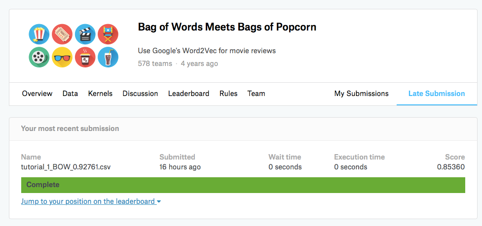

# Bag Of Words를 이용한 자연어 처리에 기반한 영화 평론 데이터에서의 감성 인식 
**kaggle 영화 리뷰** 에서 수집한 positive, negative가 레이블되어 있는 데이터 2만 5천개를 학습 시키고 
**test data**로 나머지 'kaggle 영화 리뷰' 데이터 2만 5천개를 이용하여, **Bag Of Words**을 통해 긍정, 부정을 분류하는 프로젝트

## 1. Algorithms
  참고 : https://en.wikipedia.org/wiki/Bag-of-words_model

1. 정답 레이블이 있는 'kaggle 영화 리뷰' 데이터를 전처리 (html 태그, stopword 제거 등)

2. 각 리뷰 도큐먼트 별 단어 분포를 numpy 배열에 저장 (리뷰별 단어 평균, 중간 값, 분포도 등)

3. 단어 벡터 피쳐들을 벡터화 시켜서 RandomForest 모델에 집어 넣음

## 2. Requirement
- [BeautifulSoup 4](https://www.crummy.com/software/BeautifulSoup/bs4/doc/)
- [nltk](https://datascienceschool.net/view-notebook/118731eec74b4ad3bdd2f89bab077e1b/)

## 3. Data Sets

- Training data : kaggle 리뷰 데이터 말뭉치 2만 5천 건

- Test data : Kaggle 리뷰 데이터 말뭉치 2만 5천 건 

## 4. Classification Model - RendomForest

랜덤 포레스트의 가장 큰 특징은 랜덤성(randomness)에 의해 트리들이 서로 조금씩 다른 특성을 갖는다는 점이다. 이 특성은 각 트리들의 예측(prediction)들이 비상관화(decorrelation) 되게하며, 결과적으로 일반화(generalization) 성능을 향상시킨다. 
또한, 랜덤화(randomization)는 포레스트가 노이즈가 포함된 데이터에 대해서도 강인하게 만들어 준다. 랜덤화는 각 트리들의 훈련 과정에서 진행되며, 랜덤 학습 데이터 추출 방법을 이용한 앙상블 학습법인 배깅(bagging)과 랜덤 노드 최적화(randomized node optimization)가 자주 사용된다. 
이 두 가지 방법은 서로 동시에 사용되어 랜덤화 특성을 더욱 증진 시킬 수 있다.

## 5. 결과

